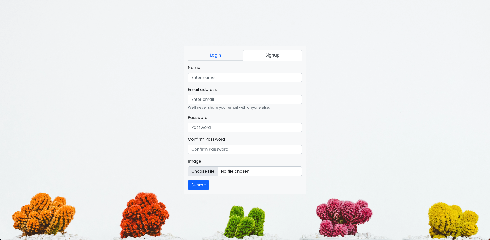
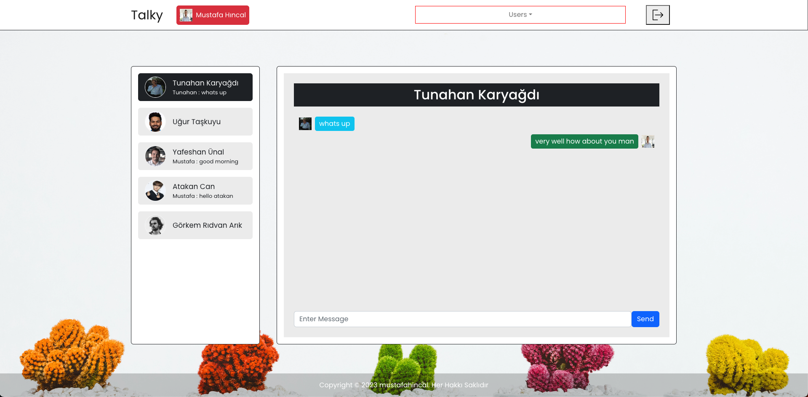
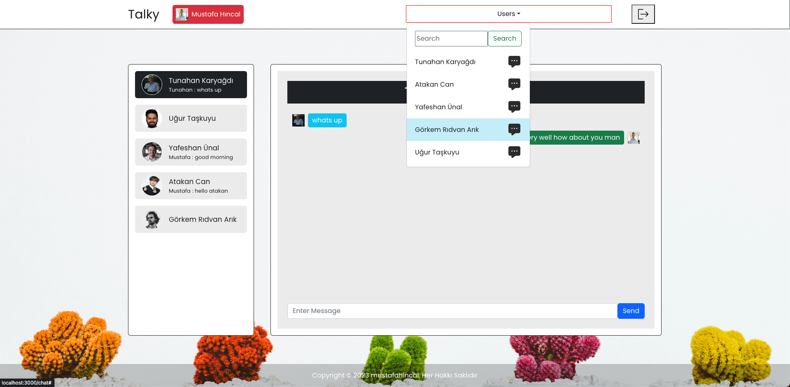

# Talky

> Talky is a Full Stack Chatting App.
> <br>
> Uses Socket.io for real time communication and stores user details in encrypted format in Mongo DB Database.

<br>

## **Technologies and techniques used in the project (Projede kullanılan teknikler ve teknolojiler)**

### **Frontend**

- **React**
- **React-Bootstrap**
- **Socket.io-Client**
- **Axios**
- **Context API**

### **Backend**

- **Node JS**
- **Express JS**
- **Socket.io**
- **Mongoose**

### **Database**

- **Mongo DB**

<br>

## **Run Locally**

Clone the project

```bash
  git clone https://github.com/mustafahincal/chat-app.git
```

Go to the project directory

```bash
  cd chat-app
```

Install dependencies

```bash
  cd client/
  yarn install or npm install
```

```bash
  cd server/
  yarn install or npm install
```

Start the server

```bash
  cd server/
  yarn start or npm start
```

Start the Client

```bash
  cd client/
  yarn start or npm start
```

## **Features**

### Authenticaton




### One to One chat



### Real Time Chatting with Typing indicators


### Search Users



## **Made By**

[Mustafa Hıncal](https://github.com/mustafahincal)
